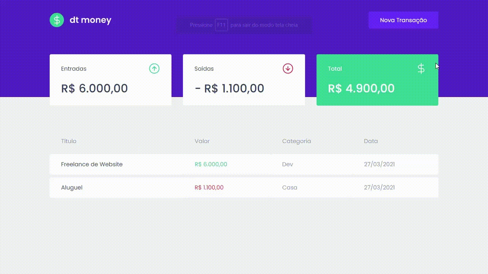

<h1 align="center">
	
</h1>

<p align="center">
  <a href="https://www.linkedin.com/in/alexsandrobezerra">
    
  </a>

  <a href="https://github.com/AlexsandroBezerra/dtmoney/blob/main/LICENSE">
    
  </a>
</p>



<p id="about"></p>

## :information_desk_person: About the project

This project was made in Ignite course.

<p id="started"></p>

## :computer: Getting started

**Clone the project and access the folder**

```bash
git clone https://github.com/AlexsandroBezerra/dtmoney.git

cd dtmoney
```

**Follow the steps below**

```bash
# Install the dependencies
$ yarn

# Start the client
$ yarn start
```

<p id="contribute"></p>

## :thinking: How to contribute

**Make a fork of this repository**

```bash
# Fork using GitHub official command line
# If you don't have the GitHub CLI, use the web site to do that.

$ gh repo fork AlexsandroBezerra/dtmoney
```

**Follow the steps below**

```bash
# Clone your fork
$ git clone your-fork-url && cd dtmoney

# Create a branch with your feature
$ git checkout -b my-feature

# Make the commit with your changes
$ git commit -m 'feat: My new feature'

# Send the code to your remote branch
$ git push origin my-feature
```

After your pull request is merged, you can delete your branch

---

Made with :purple_heart: by Alexsandro G Bezerra :wave: &nbsp;[See my Linkedin](https://www.linkedin.com/in/alexsandrobezerra)erra 👋 &nbsp;[See my LinkedIn](https://www.linkedin.com/in/alexsandrobezerra)
